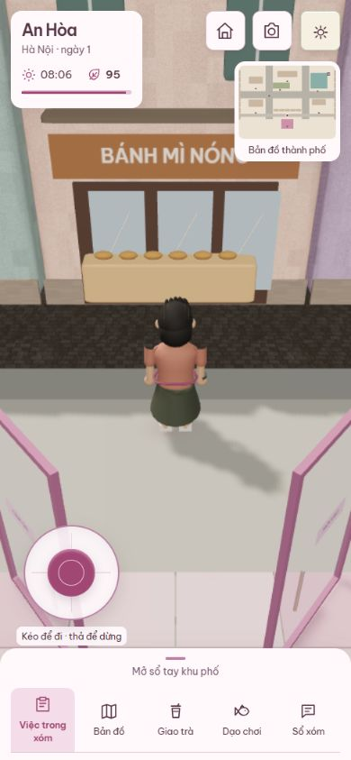
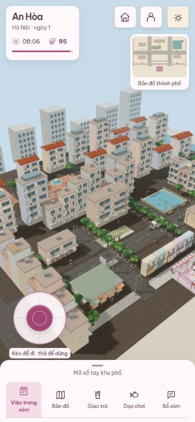

# Baseline trước lộ trình production

Kiểm tra ngày 08/10/2026, source `c18c87e238bc5e335c40c96c48e90ad8625ab3ef`, nhánh `codex/mobile-beta-foundation`.

## Git và kiểm thử

- Bản source hiện tại đã commit và push; SHA remote trùng local. Nhánh tách từ `origin/main` tại `9b59c44`, không có chênh lệch với main ở thời điểm tạo nhánh.
- `npm test`: 54 test / 15 file đạt.
- `npm run build`: đạt. Vite còn cảnh báo chunk >500 kB; chunk Babylon native khoảng 1.663 kB raw / 398 kB gzip. Đây là số build, chưa đo request tải ban đầu.
- [GitHub CI trên source SHA](https://github.com/phung086/ban-tra-sua/actions/runs/37724686622): success (npm ci → test → build).
- Chạy bằng `vite preview --host 127.0.0.1 --port 5189 --strictPort` sau build. UI production vào được game, ra phố, mở/thu sổ nhiệm vụ và đổi góc nhìn tổng thể.

## Quan sát 390×844 trên trình duyệt desktop

Engine Three.js, quality balanced; nhân vật tại x=0, z=-7. Số dưới đây đọc từ dataset canvas trong runtime, là mẫu quan sát, không phải benchmark P95. Capture native thực tế là 390×843; viewport yêu cầu là 390×844.

| Góc nhìn | drawCalls | triangles | cpuMs | frameMs |
| --- | ---: | ---: | ---: | ---: |
| Theo chân, trước cửa tiệm | 614 | 341.140 | 4,8 | 34,7 |
| Nhìn toàn khu phố | 2.612 | 1.441.087 | 11,0 | 34,7 |

`drawCalls`/`triangles` là trung bình 15 lần render theo adapter hiện tại; cần xác định rõ shadow/pass trong M1. `cpuMs` là EMA thời gian từ đầu tick được render tới khi `renderer.render` trả về, gồm cập nhật cảnh và submit; `frameMs` là EMA khoảng cách khung, game đang giới hạn khoảng 30 FPS. Không quy đổi số này thành FPS điện thoại hoặc GPU time. Logs error được browser cung cấp tại lúc đọc: không có entry; không khẳng định mọi lỗi của mọi luồng đã được loại bỏ.

## Khoảng cách tới beta

Có nền tiệm, 12 điểm đến, sáu cư dân, 30 nhiệm vụ được viết sẵn, collision solver, nhân vật skinned tạo bằng mã và nhạc tổng hợp. Một lượt chọn nhánh nhiệm vụ tối đa 18 việc. Các chương hiện chủ yếu chọn nhiệm vụ và điều chỉnh quan hệ/lời thoại; chưa có đồ thị hệ quả sâu giữa nhiều tình huống.

Góc phố vẫn có người/công trình tạo bằng hình học đơn giản, chi tiết và ánh sáng chưa đồng đều; góc tổng thể tạo workload cao. HUD núm tròn và sổ tay hiện dùng được trên viewport hẹp; chưa kiểm chứng đa chạm và độ mượt trên máy yếu thật. Chưa chạy hết các nhiệm vụ bằng tay trong lượt baseline này, chưa nghe nhạc trên loa điện thoại và chưa đo thermal/memory soak/cold load.

Ưu tiên tiếp theo: M1 đo chính xác và giảm workload cảnh, M2 hoàn thiện pipeline tải/LOD, rồi mới tăng chất lượng asset và cốt truyện theo [lộ trình](production-roadmap.md).
