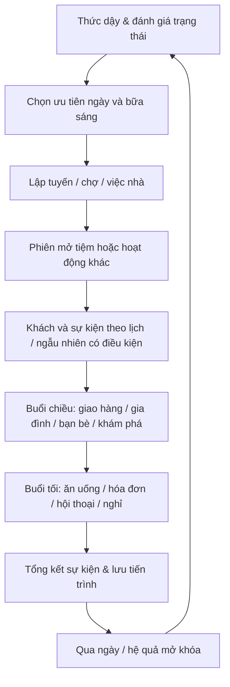

# Game Design Bible — Tiệm Trà Giữa Phố: Những Ngày Ở An Hòa

> **Trạng thái:** TẦM NHÌN / KẾ HOẠCH, chưa phải chức năng đã triển khai hay mốc đã nghiệm thu. Cập nhật 08/10/2026.
> **Thẩm quyền:** Yêu cầu sản phẩm dài hạn; **không thay thế** cổng hiện hành tại [production-roadmap](../production-roadmap.md), [iteration-protocol](../iteration-protocol.md) và [next-step-prompt](../next-step-prompt.md).
> **Đọc theo thứ tự:** tài liệu này → [life-systems](life-systems.md) → [story-and-days](story-and-days.md) → [world-and-performance](world-and-performance.md) → [data-and-save-contract](data-and-save-contract.md) → [ai-delivery-playbook](ai-delivery-playbook.md).

## 1. Lời hứa của trò chơi

Một **life-sim 3D, mobile-first, single-player, thiên về cốt truyện và quản lý tiệm trà sữa**: mỗi ngày thức dậy trong một thành phố Việt Nam hư cấu sống động, quyết định sống và làm ăn ra sao, gặp ai, yêu thương/giận hờn ai, lựa chọn điều gì và chịu hệ quả có thể nhìn thấy được sau nhiều ngày. Không phải mỗi ngày đổi màu trời hoặc bốc ngẫu nhiên khách; **một ngày mới là một màn có nhịp điệu, nhiệm vụ và biến cố riêng**, trong khi nhân vật, tiền, tình thân, lời hứa, thế giới vẫn liên tục.

Tiệm trà là điểm neo, **không phải hoạt động duy nhất**: ngủ dậy, chuẩn bị, ăn sáng, mua nguyên liệu, mở quán, pha/giao nước, xử lý khách, đi chợ, nấu ăn, gặp người thân, đi cùng bạn, nghỉ ngơi, khám bệnh khi cần, trả hóa đơn và khám phá thành phố. Trò chơi có niềm vui, tình bạn, mâu thuẫn, cô đơn, ốm mệt, sai lầm, chuộc lỗi và thời gian để hồi phục. Viết nhân vật như con người, **không biến bệnh tật/đau buồn thành phần thưởng hoặc yếu tố câu khách**.

### Trụ cột bất biến
1. **Một ngày, một câu chuyện đáng nhớ:** có khởi đầu–diễn biến–hậu quả–kết ngày, kể cả ngày bình thường. Không bắt ép mọi ngày có tai nạn lớn.
2. **Thành phố có ký ức:** lời hứa, giá bán, hàng tồn, mối quan hệ, tiền nợ, tình trạng sức khỏe và thay đổi vật lý được lưu giữa các ngày.
3. **Người là người:** cư dân có lịch, nhu cầu, mục tiêu, giới hạn, quan hệ với nhau; các sự kiện không chỉ xoay quanh người chơi.
4. **Quyền chủ động:** có thể làm quán tốt, ưu tiên người thân, đi chơi, từ chối, xin lỗi, nhờ giúp đỡ. Mỗi hướng có cách tiếp tục; không phạt cực đoan vì bỏ qua nội dung phụ.
5. **Đẹp nhưng chạy được trên máy yếu:** đồ họa 3D rõ bản sắc Việt Nam, chuyển động và va chạm đáng tin; tầng chất lượng tự co giãn, không hi sinh khả năng chơi.
6. **Sinh nội dung có kiểm soát:** tác giả tạo kho ngày, tình huống và luật; engine ghép theo điều kiện/cờ/seed có kiểm chứng, **không để AI tự bịa nhiệm vụ vào runtime**.
7. **Mở rộng hàng năm:** ngày mới, cư dân, khu phố, nghề và thành phố lân cận là content pack versioned; không hardcode giới hạn ngày hoặc bắt tạo cây truyện nhân đôi vô hạn.

## 2. Vòng lặp chơi chính

Tình huống phát sinh **đan xen** chứ không tự khóa trình tự: bạn có thể bỏ quán sớm đưa người thân đi bệnh viện, nhờ nhân viên trông quán, hoặc trả giá bằng doanh thu; không teleport miễn phí từ mọi nơi. Mỗi khung thời gian có lựa chọn rút ngắn đối với nhiệm vụ đã thành thạo (fast-forward an toàn) và đường giải quyết khi thiếu tiền/sức.

### Một màn/ngày phải có
- `dayId` ổn định, số ngày trong save và ngày trong tuần/mùa/tình trạng trời; đồng hồ in-game khác đồng hồ ngoài đời.
- **Opening hook** 30–90 giây (ngủ quên, mưa, tin nhắn, lịch đúng giờ, khách đặt trước…); chọn mục tiêu ngày.
- **Story spine** gồm 1–3 nút truyện chính, ít nhất một hành động gameplay (không chỉ đọc thoại), hậu quả và một nhịp nghỉ.
- **Daily rhythm** sáng/trưa/chiều/tối; thời gian di chuyển/ăn uống/pha chế có ý nghĩa nhưng không grind.
- **Dynamic cast** khách/NPC/xe/người đi đường theo budget và địa điểm; cùng NPC không tự nhân bản.
- **Micro-events** 0–2 lượt/ngày nếu phù hợp; ưu tiên nhất quán và sự kiện có nguyên nhân.
- **Closure** báo cáo tiền/chi tiêu/tâm trạng/quan hệ, nhắc lời hứa/hóa đơn, chọn cách nghỉ.
- **Recovery** nếu thất bại: cách làm lại/ngày kế và thay đổi câu chuyện; không khóa vĩnh viễn save.

**Ngày = màn nội dung**, **chương = nhiều ngày có tuyến chuyện**, **thành phố = thế giới liên thông theo nhiều khu**. Không phải tạo một level WebGL mới cho mỗi ngày: scene assets dùng lại, state và lịch tạo khác biệt.

## 3. Hình ảnh, âm thanh, trải nghiệm

- **Phong cách:** phố Việt Nam đương đại ấm áp, bán cách điệu có tỷ lệ và ánh sáng thuyết phục; không chạy theo photoreal nặng. Mặt tiền tiệm, ngõ nhỏ, nhà ống, chợ, hồ, cầu, công viên, trạm y tế, phố ven biển, hàng cây và ánh đèn có bản sắc, vật liệu đồng nhất.
- **Nhân vật:** silhouette, khuôn mặt, kiểu tóc, quần áo, giọng nói/phụ đề và hoạt ảnh phân biệt; cư dân quen giữ đặc trưng, khách lạ dùng tổ hợp seed + pool hợp lý; outfit thay theo thời tiết/ngữ cảnh thay vì random hỗn loạn.
- **Animation:** idle, đi/chạy, lên xuống bậc, ngồi, ăn, nấu, cầm khay/ly, trao tiền, đẩy cửa, nói, cười, buồn, mệt, vấp nhẹ; dùng blend-tree, IK tay/chân khi khả dụng trong ngân sách; không trượt chân, xuyên bàn/cây/xe/nhà.
- **Camera/UI:** một tay dùng được cho việc cơ bản, hai ngón độc lập joystick + camera; hỗ trợ dọc/ngang, nút touch >=48px, vùng an toàn, giảm chuyển động, cỡ chữ, subtitle, bỏ qua cảnh đã xem, tạm dừng rõ ràng.
- **Âm thanh:** âm phố sống động nhưng tiết kiệm, ambience lớp theo khu/giờ/mưa, nhạc dịu có cao trào theo câu chuyện, ưu tiên trộn volume hơn tải nhiều track; quản lý background tab và audio unlock.
- **Tín hiệu trạng thái:** đói, mệt, đau, deadline hóa đơn, khách sốt ruột, bạn đang chờ phải đọc được từ HUD hoặc hội thoại, không ép người chơi mở menu nhiều lần.

## 4. Thực tế có chọn lọc: không biến thành việc nhà bắt buộc

Thời gian, giá và nhu cầu **tương tự logic cuộc sống** nhưng tỷ lệ quy đổi là hư cấu và phải cân bằng gameplay, không quảng cáo là giá thời gian thực. Mọi luật có chế độ hỗ trợ:
- **Story / Cozy (mặc định beta):** hóa đơn có nhắc sớm và gia hạn, bữa ăn đơn giản/nhờ người nhà, bệnh nhẹ có hồi phục; không game-over từ túng thiếu.
- **Life (tùy chọn về sau):** giá/nhu cầu/thời gian khắt khe hơn, được công bố trước khi chọn.
- Hạn mức ngẫu nhiên bất lợi (bad-luck protection), không liên tục gặp tai nạn/ốm/mất khách; một ngày có ít nhất một đường tiến bộ nhỏ.
- Các biến cố nặng liên quan sức khỏe/tang thương/khủng hoảng phải được viết kỹ, có tuỳ chọn giản lược/skip trong accessibility.

## 5. Hiện trạng và đường phát triển thực tế

**Hiện hữu (README/roadmap tại SHA 5afb612f):** quản lý tiệm, sản phẩm/topping, đơn pha/giao, nhân viên, tồn kho, một số sự kiện ngày/khách và cư dân, các điểm đến thành phố, collision cơ bản, truyện phân nhánh và save v3. Không đồng nghĩa có đủ sinh hoạt, thành phố liên vùng, hệ thống y tế/bữa ăn, nền kinh tế đời thực hoặc đa ngày chất lượng như tầm nhìn này.

**Cổng bắt buộc:** hoàn tất M1.1 và toàn bộ M1–M10 hiện hành theo roadmap trước khi tuyên bố beta đạt. Các ý tưởng ở tài liệu này được chia thành **future epics (LC)**, có thể thiết kế/viết dữ liệu mẫu/test độc lập khi không đụng benchmark; không được đưa feature mới lên trước M1 chỉ vì tài liệu đã có.

**Không cam kết “vô hạn” theo nghĩa không cần người biên tập:** kiến trúc cho phép thêm số lượng lớn ngày và vùng mà không sửa engine; chất lượng cốt truyện, hiệu năng, nguồn lực nghệ thuật và QA vẫn đặt giới hạn thực tế. Không tạo lời thoại vô căn cứ bằng prompt gọi API mỗi lần load game.

## 6. Chỉ số thành công đề xuất

- Sau onboarding, người chơi kể lại được **điểm khác biệt của ngày hôm đó** và một lựa chọn đã tạo hệ quả.
- 7 ngày đầu có 7 opening khác biệt, không 2 ngày liên tiếp lặp cùng major beat, ít nhất 3 kết quả xuyên ngày.
- Một cư dân từng giúp hoặc làm phật lòng có phản ứng và lịch/giá/lời nhờ thay đổi sau 1–3 ngày.
- Tất cả tình huống có nhánh soft-fail và đường phục hồi; không vòng lặp sự kiện vô tận hoặc mắc nợ âm vô lý.
- Bằng chứng performance/graphics, save/backward compatibility, nghiệp vụ kinh tế, content graph và thiết bị thật tuân theo cổng [roadmap](../production-roadmap.md); không đánh tráo simulator/browser thành Android/iPhone.

## 7. Từ vựng thống nhất cho AI

- **Day pack:** gói dữ liệu cho một ngày/màn tác giả thiết kế, với entry/beat/exit, không phải một build mới.
- **Beat:** sự kiện có điều kiện, tác động và kết quả hiển thị.
- **Episode/Chapter:** tập hợp ngày có arc và kết nối.
- **City zone:** khu world stream theo vị trí với asset/nav/collision/interactions.
- **Persistent NPC:** nhân vật có danh tính và trạng thái lưu; **ambient NPC** chỉ xuất hiện trang trí/hoạt động.
- **World ledger:** lịch sử giao dịch/sự kiện exactly-once.
- **Seed:** số hạt tái lập các biến cố ngẫu nhiên của save/ngày, không sinh nội dung tùy tiện.
- **Acceptance gate:** cổng định lượng + thử nghiệm thiết bị + bằng chứng cần trước khi chuyển mốc.
