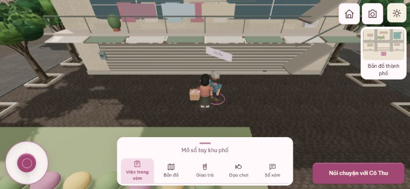
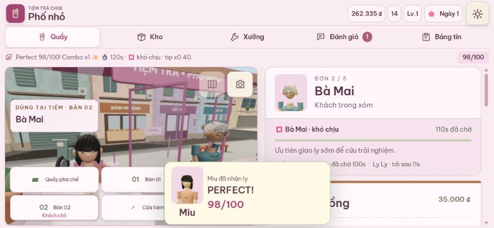
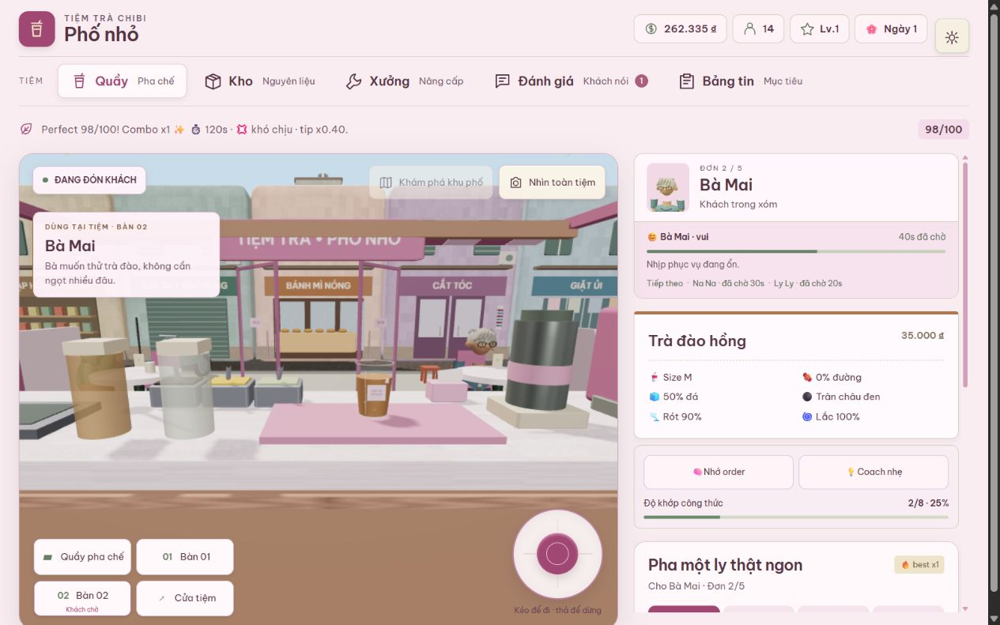

# Tích hợp các nhánh và chạy thử hiện trạng — 10/10/2026

Theo yêu cầu chủ dự án: kéo code Git mới nhất, merge các nhánh, xử lý conflict và chạy thử. Nhánh `codex/integrate-game-20261009` tạo từ remote main `ac5adbb00f19b28226efa62e15f6ee1f77aa6364`, giữ ngày bắt đầu trong tên. Source đã kiểm chứng: `aaff126b40a21bf65ecf087704b0a0b8396847f9`. Báo cáo và ảnh thêm sau source này không đổi runtime.

## Nhánh và conflict

| Nhánh | Tip lúc kiểm tra | Nội dung giữ lại |
| --- | --- | --- |
| mobile-beta-foundation | `1124fa3` | Mobile autofit, batching theo khu, benchmark và docs M1; near sector 12/radius 35, distant sector 32 theo tip mới |
| frame-pacing-30fps-20261008 | `69d72a1` | FramePacer 30 FPS và reset sau resume |
| m1-benchmark-gate-isolated | `edd0085` | Ngân sách shadow light, báo cáo riêng và gate.json; giữ benchmark mới hơn |
| life-sim-world-bible-20261008 | `528a55e` | Ba tài liệu bổ sung, giữ World Bible trên main |
| life-t1-02-calendar-planner-20261008 | `647c69a` | Đồng bộ lịch sử nhánh đã squash; giữ trạng thái accepted mới |
| life-t1-02-acceptance-20261009 | `b7a4840` | Báo cáo acceptance |
| life-t1-03-boundary-tests-20261009 | `77cfa17` | Episode validator, guarded transitions và boundary/affordability tests |
| life-t1-03-evidence-20261009 | `576e209` | Báo cáo, backlog và CI evidence bổ sung |

Bảy nhánh v1–v5 đã được thay thế được hòa giải lịch sử bằng `ours`, **giữ source hiện tại**: chibi-playable-base, gameplay-progression-v2, gameplay-feel-v3, order-service-flow-v4, order-service-flow-v4-sync, spatial-interactions-v4-sol, ui-art-direction-v5-sol. Đây không phải kích hoạt mọi phiên bản UI cũ đồng thời. Đã đối chiếu file: toàn bộ export engine của bốn nhánh gameplay còn có trong bản mới; OrderExperience thay OrderServicePanel và bổ sung memory/coach/recall; các component legacy khác còn trong repo. Lịch sử cũ giữ nguyên để tra cứu.

Mọi tip remote đã kiểm tra đều là ancestor của HEAD tích hợp. [Snapshot nhánh/SHA](integration-20261010-branches.json) ghi ranh giới lần gom code; commit được AI khác push sau snapshot cần kiểm tra riêng.

- README giữ cả World Bible và kế hoạch production.
- renderQuality/runtime giữ constrained-hardware, trần chất lượng mobile, shadow rules và layout/coarse-pointer detection; không bỏ hỗ trợ điện thoại xoay ngang. Giữ tests của cả hai nhánh.
- Benchmark giữ scene integrity, camera sweep, collision/NPC/craft/delivery smoke và screenshot recovery mới; thêm threshold failures/gate.json. Workflow so sánh sector 16/32 trên cùng source, **không** tự đánh giá toàn bộ thay đổi shadow trước/sau.
- Calendar/backlog giữ acceptance mới thay vì trạng thái review cũ; giữ T1-03 regression tests.
- Mobile orientation CI chạy trên main/nhánh tích hợp. Không còn file unmerged hoặc conflict marker.

## Kiểm chứng source aaff126

- `npm test`: **114 tests / 24 files**, cộng design validator: 47 task, 30 ngày dự kiến, dependency DAG, sample day-001 và ledger keys đạt.
- `npm run build`: đạt; Babylon chunk khoảng 1.663 kB raw / 398 kB gzip vẫn gây advisory >500 kB. Chưa đo cold-load trên mạng điện thoại.
- `node --check` cho m1-browser-benchmark, mobile-layout-smoke và m1-near-ab-benchmark: đạt.
- [CI test/build](https://github.com/phung086/ban-tra-sua/actions/runs/37962966123): success.
- [Mobile orientation/autofit cùng SHA](https://github.com/phung086/ban-tra-sua/actions/runs/37962966195): success; kiểm layout, canvas không remount khi xoay, núm, pha/đóng/giao cốc khi đổi chiều và sổ tay khu phố.

Production preview: `vite preview --host 127.0.0.1 --port 5188 --strictPort`. Kiểm bằng in-app browser desktop, viewport 360×800, 390×844, 844×390, 1280×800; không mô phỏng GPU điện thoại thật.

1. Đọc save đã có trên 127.0.0.1, không reset hoặc hủy đơn phố đang mang. Kéo núm x=0 → 0,07 rồi nhả: data-active=false; mở sổ khóa núm, thu gọn mở lại.
2. Tự đi tới Cô Thu, hiện nút nói chuyện khi gần. Câu vui vẻ tạo lời đáp “Khéo miệng đấy…” và thân thiết 0 → 1. Dialog cuộn ở 360px; không tràn ngang ở 360/844px.
3. Chuyển Three → Babylon → Three qua menu. Babylon dựng người/cảnh và giữ vị trí (0,-35); không có error entry lúc kiểm. Khôi phục Three và quality auto.
4. Dùng origin localhost cho lượt kiểm thử riêng, giữ save trên 127.0.0.1. Bỏ qua onboarding, mở ca, chọn Matcha/trân châu, giữ/nhả định lượng, chốt lắc, dập nắp, bê cốc, đi bàn 01, xoay ngang khi đang bê và giao Miu.
5. Giao thành công **98/100**; tiền 220.000 → 262.335, uy tín 12 → 14, chuyển đơn 2; Matcha 8 → 7, ly M 14 → 13. Reload giữ tiền, kho và đơn; tiếp tục điều khiển/pha được.
6. Va chạm tiệm: giữ Up 3 giây từ (0;3,15), dừng (0;2,06); giữ thêm 1,5 giây vẫn z=2,06; đi lùi được tới z=3,04. Xe/tường/route có tests logic trong suite; chưa đâm xe bằng tay ở lượt này.
7. Lúc đọc console, không có error entry ở hai renderer. Có warning độ chính xác shader Three. Một timeout công cụ đọc frame tree khi reload; tab vẫn tải và lần quan sát sau hoạt động bình thường.

## Giới hạn và việc tiếp theo

Dataset canvas chỉ là mẫu EMA/trung bình render, không phải P95: Three balanced follow (0,-7), 390px khoảng 761 calls / 455.780 triangles; Three light overview (0,-35), 360px khoảng 1.575 calls / 1.139.390 triangles. Camera/vị trí/quality/phiên khác baseline c18c87e nên không tính phần trăm cải thiện. Workload còn vượt ngân sách M1; chưa nghiệm thu beta trên máy yếu.

Người/công trình vẫn procedural. RNG/lịch ngày/episode validator là pure core; 30 ngày trong docs chưa playable, chưa có đầy đủ save v4/reducer/UI adapter. Nhiệm vụ đang chơi vẫn dùng hệ thống khu phố hiện tại.

Reload tái lập thời gian chờ khách về 0 dù giữ tiền/kho/đơn; storage.ts đang rebase queue/currentOrderQueuedAt như vậy. Cần lưu elapsed service time để pause/offline không phạt người chơi nhưng reload không hồi kiên nhẫn. Ghi nhận để sửa ở vòng save riêng, không coi resume đã nghiệm thu hoàn toàn.

Chưa nghe nhạc trên loa điện thoại, chưa đo GPU timing/P95/thermal/soak 15 phút trên Android 3–4GB/iPhone, chưa kiểm đa chạm thật và mọi kết thúc nhiệm vụ bằng tay. CI xanh không thay thế các cổng này.
